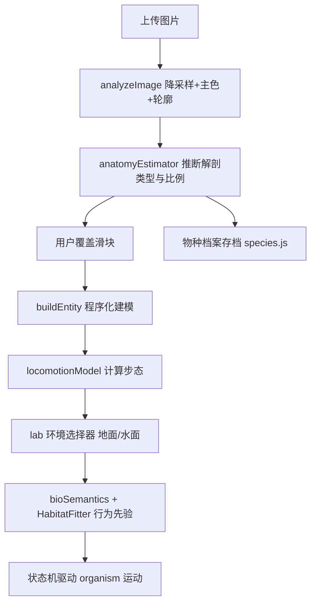

## 用户需求

1. 竹虎页（tiger.html）与寒梅页（plum.html）各增加一个"回到 home（home.html）"的环形呼吸光点导航，鼠标悬停闪烁；保持与 home 页物种实验室光点一致的视觉语言。
2. 修复大雁头颈脱节：当前头部未随脖子运动（"脖子是脖子，头是头"）。需让头部与颈尖变换一致、视觉自然衔接。
3. 物种实验室（lab.html）持续研发（约 6 小时自主迭代）：支持用户上传图片 → 依据物种解剖结构程序化建模 → 赋予生物运动的计算方式 → 让生物在各类拟生环境中科学运动；新增"意思模块"，后续与生物习性复合拟合（环境 × 习性 → 行为先验）。纯前端离线实现，不引入外部 ML 推理服务。

## 核心特性

- 回 home 光点：tiger/plum 两页底部固定环形光点，复用 home 的呼吸/闪烁动画，一键回展厅。
- 头颈同步：大雁头部锚定到颈尖真实世界变换并随 S 弯行进，视线锁定由"强制世界水平"降级为可调的轻微稳定，消除缝隙与脱节。
- 图像建模范式：上传图 → 轮廓/主轴/主色分析 → 推断解剖类型与体型比例 → 用户覆盖 → 程序化建模。
- 生物运动计算：以解剖类型 + 尺寸为键的运动学模块（Froude 数定步态频率、腿摆钟摆、颈惯性），替代 ad-hoc tick 公式。
- 拟生环境：实验室预览内嵌环境选择（溪涧/梅塘/雪竹/远山），生物按地面/水面/障碍反应运动。
- 意思模块：物种生态语义数据结构 + 栖息拟合引擎，由环境 × 习性推导行为先验并回灌状态机；本期先建可组合模型与 UI 骨架。

## 技术栈

- 前端：原生 HTML + JavaScript（ES Module）+ THREE.js r160（WebGLRenderer / OrbitControls / SkinnedMesh / Skeleton）。
- 物种实验室：现有 lab.js 已具备 3D 视窗、参数表单双向绑定（防抖 120ms 重建）、图像上传分析（analyzeImage）、四足 BioEntityMesh 与禽类 buildAvianBody、状态机驱动器、species.js 存档。
- Task 3 全部在浏览器内离线完成：图像分析用 Canvas 2D 降采样像素统计；建模复用 buildAvianBody / BioEntityMesh；环境复用 environment-plum.js / physics.js 的轻量逻辑。

## 实现方案

### Task 1 · 回 home 光点

- 将 home.html 内联的 `.idea-orb / .orb-ring / .orb-core / orbPulse / orbBreathe / orbFlicker` 样式（第 24–62 行）抽到 `frontend/css/style.css` 作为共享样式，并在 home.html 移除该内联段以避免重复。
- 新增修饰类 `.idea-orb--home { position: fixed; right: 22px; bottom: 22px; margin: 0; z-index: 20; }`。
- 在 tiger.html、plum.html 的 `<body>` 内（HUD 之外）各加一处：`<a class="idea-orb idea-orb--home" href="home.html"><span class="orb-ring"></span><span class="orb-core"></span><span class="orb-label">展厅</span></a>`。

### Task 2 · 大雁头颈同步

根因：头（headGroup）是颈顶骨 `bUp` 的子节点，本应随颈尖变换；但 `_head` 中视线锁定补偿 `hg.rotation = -(n1x+n2x)+...` 把头反向拧回世界水平，且 rest 偏移 `headGroup.position = np - curve.getPoint(1.0)` 把头座在颈中段（neckPos），而颈管延伸到 curve 顶端（apex 高于 neckPos≈0.133m），导致颈尖外露、视觉断开。

- 锚定修复：`headGroup.position.set(0,0,0)`（锚在 `bUp` 原点 = 颈尖 apex），头球/喙/目经已有 headPos 落在颈尖之上，消除缝隙。
- 视线锁定参数化：新增可调混合 `headLock`（默认 0.15，禽类 style 可覆盖）。补偿量由 `-(n1x+n2x)` 改为 `-(n1x+n2x) * (1 - headLock)`，使头随颈尖保留大部分倾斜、仅轻微稳定；peck/preen/level 模式同法缩放。
- 一致性：bird.js 的 `_neckKinematics` 同源公式做同样降级，保持锦鸡/大雁一致。
- 验证：playwright 截图 plum.html 大雁，确认头随颈尖 S 弯行进、无外露缝隙。

### Task 3 · 物种实验室持续研发（6 小时分阶段）

纯前端离线；先打通"上传图→建模→在环境里动→带语义"的垂直切片，再逐阶段深化。各阶段以浏览器截图 + 程序化断言验证，分段提交可运行进度。



## 实现须知

- 性能：沿用 lab.js 既有 120ms 防抖整体重建；图像分析降采样到 48px；运动学每帧只改 tick 上下文不重建实体；避免每帧分配大对象。
- 爆炸半径控制：不改动 tiger/plum/home 的场景与四足逻辑；Task3 仅在 lab 体系内扩展（新增模块 + 扩展 species.js schema），向后兼容旧档案（缺字段给默认值）。
- 日志：复用既有 console；图像推断给出 confidence 供用户判断是否覆盖，不在日志打印图片像素。

## 架构设计

- 新增模块全部挂在 lab.js 调用链上，互不耦合：anatomyEstimator（输入 Image → AnatomyEstimate）、locomotionModel（输入 anatomyType+dimensions → 步态参数）、labEnv（轻量预览环境，地面/水面/障碍）、bioSemantics（语义 + HabitatFitter 行为先验）。
- 数据流：上传图 → analyzer → estimator → record（可覆盖）→ buildEntity → locomotionModel 注入 gait → labEnv 提供地面/水面上下文 → bioSemantics 产出 behaviorPriors → 状态机。

## 目录结构

```
frontend/
├── css/
│   └── style.css              # [MODIFY] 抽入 .idea-orb 共享样式 + .idea-orb--home 固定定位
├── tiger.html                 # [MODIFY] 新增回 home 光点
├── plum.html                  # [MODIFY] 新增回 home 光点
├── home.html                  # [MODIFY] 移除内联 .idea-orb 样式（已抽到 style.css）
├── js/
│   ├── bio/
│   │   ├── AvianBodyBuilder.js # [MODIFY] headGroup 锚定颈尖；返回 headLock 句柄
│   │   └── anatomyEstimator.js # [NEW] 图像→解剖推断（轮廓/主轴/主色→AnatomyEstimate）
│   ├── locomotionModel.js     # [NEW] 解剖类型+尺寸→生物步态参数（Froude/钟摆/颈惯性）
│   ├── bioSemantics.js        # [NEW] 意思模块：生态语义 + HabitatFitter 行为先验
│   ├── labEnv.js              # [NEW] lab 预览轻量拟生环境（地面/水面/障碍反应）
│   ├── goose.js               # [MODIFY] _head 视线锁定按 headLock 缩放；解构 headLock
│   ├── bird.js                # [MODIFY] _neckKinematics 同源降级锁定
│   ├── lab.js                 # [MODIFY] 接入 estimator/locomotion/labEnv/semantics；扩展 UI
│   └── species.js             # [MODIFY] 扩展存档 schema（anatomy 推断 + semantics 字段）
├── lab.html                   # [MODIFY] 新增环境选择器、意思模块面板、推断结果展示
└── css/lab.css                # [MODIFY] 新增环境选择器/意思模块/推断卡片样式
```

## 关键代码结构（接口契约）

```
// anatomyEstimator.js
export function estimateAnatomy(img) {
  // 返回 { anatomyType, dimensions:{width,height,length},
  //         proportions:{neckLen, legLen, tailLen},
  //         palette:string[], confidence:number }
}
// locomotionModel.js
export function computeGait(anatomyType, dimensions) {
  // 返回 { freq, swing, spine, tail, neckPhase }（供状态机 tick 消费）
}
// bioSemantics.js
export function fitHabitat(semantics, environment) {
  // 返回 behaviorPriors:{ aggression, boldness, activity, social, foraging }
}
```

## 设计风格

延续项目"宣纸水墨 + 朱砂点缀"的国画拟生美学，不引入第三方组件库。环形呼吸光点与物种实验室新面板均走同族视觉。

### 1. 回 home 光点（tiger.html / plum.html）

- 复用 home 的环形光点：朱砂色呼吸光环（orbPulse 缓慢脉动）+ 中心发光核心（orbBreathe）+ hover 高频闪烁（orbFlicker）。
- 固定定位右下角（right:22px; bottom:22px; z-index:20），不随画布滚动；标签"展厅"常态半透明、hover 转朱砂，提示"返回展厅"。
- 与 HUD 的纯文字"展厅"链接并存不冲突，光点作为更醒目的主入口。

### 2. 物种实验室 · 意思模块与环境选择器（lab.html）

- 顶部视窗工具栏新增"环境"分段控件（溪涧/梅塘/雪竹/远山），选中后预览地面/水面随之切换。
- 左侧"物种数据仓库"卡下方新增"图像推断"结果卡：展示推断的解剖类型、体长/身高/颈长/腿长比例条与置信度，附"采用推断"按钮（覆盖手动滑块）。
- 底部"意思模块"卡：生态位/食性/活动节律/社会性 四组语义输入（下拉或滑块），与"物种关系"并列；右侧实时显示"栖息拟合"推导出的行为先验热力条（攻击性/胆量/活跃度/社群/觅食）。
- 整体保持 lab 既有的宣纸质感、细描边、克制的朱砂强调色，新增面板沿用 .fieldset 卡片风格。

## Agent Extensions

### Skill

- **playwright-cli**
- 用途：各阶段在浏览器中打开 tiger.html / plum.html / lab.html，截图验证大雁头颈衔接、图像推断、环境切换、意思模块与生物运动效果。
- 预期结果：产出可肉眼核对的截图文件，确认 UI 与 3D 行为符合预期，作为每阶段交付的验证依据。

### SubAgent

- **code-explorer**
- 用途：Task 3 深度探查既有 anatomy/motion/环境模块（BioEntityMesh、buildAvianBody、environment-plum.js、physics.js、species.js）与 lab.js 调用链，精准定位扩展点与兼容约束。
- 预期结果：给出准确的函数签名、数据字段与改动边界，避免破坏四足/场景现有逻辑，保证新模块可无缝接入。