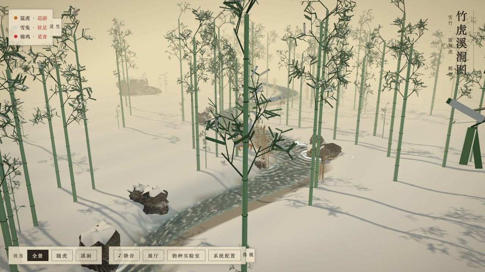

# 世界古典美术拟生平台 · Living Classical Art

**中文** · [**English**](#english)

**🌐 在线展厅（GitHub Pages，点开即看，无需部署）：<https://panglaohupanglaohu.github.io/TigerInBamboo/>**

[](https://panglaohupanglaohu.github.io/TigerInBamboo/)

> 为世界古典美术中的人、动物与环境进行生态模拟 —— 画中的生物与植物都是**自主智能体（Autonomous Agents）**，
> 平台吸收当代最强的拟生（Artificial Life / Behavioral Animation）技术，让古画"活"过来。

首个场景：**《竹虎溪涧图》**（`tiger.html`）—— 以狩野山乐《竹虎图》的斑斓猛虎为主角，
竹林与雪景溪涧的环境取自东京国立博物馆藏·雪舟《四季花鸟图》屏风的溪涧意趣。

第二幅：**《寒梅归雁图》**（`plum.html`）—— 五层纵深布景：前景山石与石径 → 繁花古梅及伴生小竹芦苇 →
塘边缓坡（塘水环绕梅根成湾、留出 1 米土地，栖雁立于坡）→ 静水塘与上空归飞雁群（V 字编队、盘旋渐降、
定翼进近 → 拉平扑翼减速 → 触水滑跑；踏水助跑起飞、巡航收蹼、空中翼面全展）→
四重没骨远山（西湖式层峦，缓丘相叠、无孤峰）。
大雁为雁形目（ANSERIFORMES·鸭科·雁属）自主智能体，躯体由 AvianBodyBuilder 比例覆写生成（长颈/肥体/阔翼）。
该画配置独立成页：`plum-config.html`（与竹虎溪涧配置分开，归雁/花木/环境/机位/歌单全参数可调）。

入口 `/` 为**展厅导航页**（`home.html`）：古画原作封面画卡（竹虎图 / 寒梅归雁图，点击入画）+
「待君题壁」卡（上传你的原作，开一方拟生空间）+ 物种实验室环形光点导航，全页中英双语切换。

## 核心理念

平台智能体设计致敬 Tu & Terzopoulos 的经典论文 *Artificial Fishes: Physics, Locomotion, Perception, Behavior*
（本仓库理念参考，见 `docs/references`）：将每个生物**整体建模为自主智能体**，
具备 感知（Perception）→ 行为决策（Behavior）→ 运动控制（Locomotion）的完整闭环，
不做关键帧脚本，动作由状态机与环境交互涌现：

- **猛虎**：骨骼驱动的整体皮肤（SkinnedMesh）+ 猫科对角步态 + 路径巡游/驻足状态机，尾部链骨可缠竹；发现雪兔会缓步接近相伴
- **雪兔**：兔形目 SALTATORIAL 跳跃行（蛋形弓背、后肢折叠、双腿同频蹬跃），竹林环游，虎近身则驻足等候
- **锦鸡**：fear 内驱力状态机（觅食 → 饮水 → 警觉冻结 → 拍翅奔逃 → 惊飞滑翔 → 栖止归飞），数量可配
- **捕食（音乐触发）**：BGM 切至《短歌行》时虎开启狩猎 —— 潜行压低 → 爆发冲刺 → 抛物线飞扑（中途劫获）→ 进食归位，全参数配置页可调
- **母女对话**：虎为女、兔为母 —— 中国传统式问安，溺爱应答（内置脚本 / 可接 LLM），中文女声 TTS + 头顶气泡
- **竹林**：Cannon.js 刚体 + 竹脚球铰约束 —— 虎身经过时被撞开，弹性回正；风扭矩按风向摇摆
- **天气**：温度决定雨雪（>0℃ 雨丝 / ≤0℃ 落雪），风向统一驱动雨雪飘移与竹摆
- **物种关系矩阵**：在配置页以"捕食 / 警戒回避 / 互利 / 竞争"等关系配置智能体间作用（对应论文中的 predator–prey、fear/hunger 驱动模型）
- **物种实验室**（`lab.html`）：上传图片 → 轮廓/主轴/主色分析**推断解剖结构**（解剖类型 + 体型比例）→ 程序化建模；以**生物运动学**（腿倒摆自然频率 / Froude 数）计算步态 → 让生物在**拟生环境**（溪涧/梅塘/雪竹/远山）中科学运动；**意思模块**以物种生态语义 × 栖息环境拟合行为先验，回灌状态机。保存后入溪涧图漫游并按关系矩阵互动
- **题壁工作空间**（`wall-workspace.html`）：从展厅「待君题壁」卡上传任意古画原作 → 纯前端离线图像分析（Otsu 分割 / PCA 主轴 / K-means 主色）自动推断画境与生灵 → 进入中央 Three.js 工作区：**六种画境**（留白墙 / 溪涧 / 梅塘 / 雪竹 / 山岩 / 林下）× **四种天光氛围**（纸 / 晨 / 昏 / 月）× **七种生灵**（原作生灵 / 伏行走兽 / 山野蹄兽 / 跳跃小兽 / 塘岸禽鸟 / 鱼影 / 蝶群），生物力学步态驱动 —— 让任何一幅古画当场"活"起来
- **回展厅光点**：竹虎（`tiger.html`）与寒梅（`plum.html`）场景页右下角均设环形呼吸光点，一键返回展厅（`home.html`）

## 技术要点

### 虎：生物生成管线（四模块解耦）
- **物种数据仓库**（`bio/BiologicalTaxonomyRegistry.js`）：纯数据定义，按拉丁学名组织（食肉目-猫科-豹属-虎 / 兔形目-兔科-兔属-雪兔），含边界盒尺寸、肩高、渲染配置；已预留马科数据可横向扩展
- **骨骼解剖学装配器**（`bio/AnatomyRiggingEngine.js`）：22+ 根骨骼的通用层级（脊椎三段 + 颈/头/下颌 + 四肢各三段 + 尾五段，兔科增双长耳骨），按肩高自动推算四肢长度与关节走势（趾行 Z 形 / 蹄行直立 / 跳跃行后肢深折）
- **程序化网格生成器**（`bio/ProceduralSkinGenerator.js`）：轮廓管躯干 + 附接腿管 + 独立锥形细分尾管合并为单一 `BufferGeometry`，按解剖区间为每个顶点精确注入 `skinIndex/skinWeight`（兔科为蛋形弓背轮廓 + 折叠后肢最近骨段吸附），`computeVertexNormals()` 平滑着色
- **状态机动画驱动器**（`bio/FelineLocomotionController.js`）：运行期只操纵骨骼旋转矩阵 —— IDLE（呼吸/扫视）/ WALK（猫科对角步态 / 兔科双后肢同频蹬跃 + 弓背 + 兔耳惯性摆动）/ ROAR（昂首张嘴）；尾五节链按相位延迟甩鞭
- **聚合实体**（`bio/BioEntityMesh.js`）：壳层皮毛 Shell Texturing 在构建期用 `onBeforeCompile` **一次编译** N 层壳（沿法线逐层膨胀、噪声 `alphaMap` 逐层稀疏），运行期零着色器改动，杜绝 WebGL 报错
- **行为层**（`tiger.js` / `rabbit.js`）：虎巡游路径/驻足状态机、觅母缓步接近（发现雪兔 7m 内减速靠近、相伴片刻）、Cannon kinematic 刚体、缠竹尾、虎斑顶点色注入；兔竹林环游（逐竹蹦跳目标点）、虎近身驻足等候
- **母女对话**（`dialog.js`）：虎（女儿）中国传统式问安 → 兔（母亲）溺爱应答；母女**各自独立配置**大模型接口（OpenAI 兼容，留空走内置脚本）与语音（嗓音/语速/音高/音量，浏览器 speechSynthesis 中文女声），气泡投影跟随头顶；触发条件为母女相距 2.8m 内

### 禽：连续蒙皮长颈 + 探头顿挫运动学
- **连续蒙皮长颈**（`bio/AvianBodyBuilder.js`）：长颈为沿中心曲线生成的 `TubeGeometry` 蒙皮管（可烘焙 S 型弯曲），
  骨链 `Spine_Chest → Neck_Lower → Neck_Upper` 双骨骼权重插值 —— 根治早期拼接式脖颈的"断颈"问题；
  构建器向动画层暴露 `headBone / headGroup / spine` 句柄
- **行走探头顿挫**（`bird.js` / `goose.js`）：双颈骨相位差对冲 + 幂次顿挫正弦（pow3 波形）+ 视线锁定补偿，
  行走时头部呈"探-停-探-停"的鸟类典型顿挫，颈呈自然 S 型曲线；物种实验室的禽类预览统一接入同一套颈运动学
- **头颈同步**：头部（`headGroup`）锚定至颈顶骨 `bUp` 的颈尖真实变换，并新增可调 `headLock` 将"视线锁定"降级
  （头保留大部分颈倾摆），行走时头随颈 S 弯一起行进，根治早期"头是头、脖子是脖子"的脱节

### 物种实验室：图像驱动的解剖建模 → 生物运动 → 意思模块
- **图像推断**（`bio/anatomyEstimator.js`）：上传图经 `analyzeImage` 降采样，用前景像素二阶矩求主轴方向与伸长率，
  结合纵横比推断解剖类型（禽 / 蹄行 / 趾行 / 跳跃行）与颈长/腿长/尾长比例，给出置信度供用户覆盖
- **生物运动学**（`locomotionModel.js`）：以解剖类型 + 体型尺寸为键，由腿长推倒摆自然频率 f=(1/2π)√(g/L)，
  据 Froude 数 Fr=v²/(gL) 标定步态区；物种实验室"采用推断"即按此重算步态（freq/swing/spine/tail）
- **拟生环境**（`labEnv.js`）：预览环境可选溪涧 / 梅塘 / 雪竹 / 远山，提供地面 / 水面 / 气候上下文；
  禽类在梅塘水面浮游、雪竹落雪飘移，并由环境驱动反应运动
- **意思模块**（`bioSemantics.js`）：物种生态语义（生态位 / 食性 / 活动节律 / 社会性）× 拟生环境 → 栖息拟合
  `fitHabitat` 推导行为先验（攻击 / 胆量 / 活跃 / 社群 / 觅食 / 亲和），回灌状态机与运动学，
  实现"环境 × 习性"复合拟合，后续可接更细的生物习性库

### 题壁工作空间：任意古画 → 拟生空间
展厅「待君题壁」卡上传原作图片后（暂存于 sessionStorage），`wall-workspace.js` 调 `imageAnalysis.js`
（灰度降采样 → Otsu 自动阈值分割 → 前景包围盒 / PCA 主轴 / K-means 主色板）→ `bio/anatomyEstimator.js`
按解剖先验（禽 / 蹄行 / 趾行 / 跳跃行）推断解剖类型与颈/腿/尾比例，再由 `locomotionModel.js` 生物力学
步态驱动生灵在六种画境、四种氛围的工作区中游走；所有推断项均可在面板上覆盖调整。

### 竹：刚体 + 球铰
每根竹是 Cannon 动态刚体（Box），竹脚以 `PointToPointConstraint` 球铰锚定地面；
回正采用**速度级 PD 控制**（角速度向"回正轴 × 刚度"混合），碰撞冲量自然保留 —— 虎推开、松手弹回。

### 天气系统
配置页"天气"栏独立：温度（>0℃ 下雨 / ≤0℃ 下雪）、降水强度（控制粒子密度）、风力、风向（0=北 90=东）。
雨为倾斜线段雨丝，雪为飘点，落地判定用物理地形 Heightfield。

### 背景音乐
`frontend/assets/audio/` 歌单顺序循环（`bgm.mp3` → `duange_xing.mp3` 尺八·短歌行，后者兼作捕食触发曲）；
mp3 已随仓库分发，在线展厅开箱即有音乐。浏览器自动播放策略要求首次点击/按键后启动；
场景页有静音切换按钮，配置页可调音量（保存后刷新生效）。

### 地形与物理
`physics.js` 统一 Cannon 世界：地形由解析高度场采样为 64×64 `Heightfield`，
竹、虎、（预留的）岩石统一在同一物理时空解算；雨雪落地复用同一高度数据。

## 项目结构

```
TigerInBamboo/
├── index.html               # 仓库根跳转页：GitHub Pages 入口 → 展厅
├── backend/                 # Python 后端（FastAPI）
│   ├── main.py              # 静态托管 + /api/config 配置读写（含旧配置迁移）
│   └── requirements.txt
├── frontend/                # Three.js 前端（ES Modules，three 已本地化）
│   ├── home.html            # 展厅导航页（/）：古画原作画卡 + 待君题壁（上传原作）+ 实验室光点导航，中英切换
│   ├── tiger.html           # 3D 场景：竹虎溪涧
│   ├── plum.html            # 3D 场景：寒梅归雁
│   ├── wall-workspace.html  # 题壁工作空间：上传原作 → 自动推断画境/生灵 → 拟生工作区
│   ├── plum-config.html     # 寒梅归雁独立配置页（归雁/花木/环境/机位/歌单）
│   ├── config.html          # 系统配置页（场景/天气/虎/锦鸡/视觉/生态关系）
│   ├── assets/vendor/       # 本地化依赖：cannon-es.js、three@0.160.0（含 OrbitControls/GLTFLoader/BufferGeometryUtils）
│   ├── assets/audio/        # 背景音乐（bgm.mp3 / duange_xing.mp3，随仓库分发）
│   ├── css/style.css
│   └── js/
│       ├── bio/             # 生物生成管线（数据/几何/骨骼/动画解耦）
│       │   ├── BiologicalTaxonomyRegistry.js  # 物种数据仓库（拉丁学名组织，含鸡形目/雁形目禽类）
│       │   ├── AnatomyRiggingEngine.js        # 骨骼解剖学装配器（通用骨骼层级）
│       │   ├── ProceduralSkinGenerator.js     # 程序化网格生成器（顶点/法线/权重）
│       │   ├── FelineLocomotionController.js  # 状态机动画驱动器（IDLE/WALK/ROAR）
│       │   ├── AvianBodyBuilder.js            # 禽类躯体构建器（连续蒙皮长颈，锦鸡/归雁/自定义鸟）
│       │   ├── anatomyEstimator.js            # 解剖结构推断（解剖类型 + 体型比例 + 置信度）
│       │   └── BioEntityMesh.js               # 聚合实体（壳层皮毛一次编译）
│       ├── config.js        # 默认配置 + API 读写（离线回退 localStorage，含旧版迁移）
│       ├── physics.js       # Cannon 世界：地形 Heightfield、刚体注册、定步长推进
│       ├── environment.js   # 金笺纸天光、雾、雪地、溪涧、岩石、雨雪粒子
│       ├── environment-plum.js # 寒梅场景环境：缓坡草岸、静水塘、石径组石、四重远山、薄雪
│       ├── plumtree.js      # 古梅（锥化主干+分形疏枝+繁花/花蕾）、小竹丛、塘岸芦苇、落花瓣
│       ├── goose.js         # 大雁智能体：V 字归飞编队、滑翔进近/拉平减速/滑跑落水、踏水助跑起飞、游水、岸边栖止觅食
│       ├── ui-plum.js       # 寒梅视角预设（全景/梅下/塘雁/归飞/远山）与面板
│       ├── plum-main.js     # 寒梅归雁图启动与主循环
│       ├── tiger.js         # 猛虎智能体：行为层（巡游/驻足状态机、觅母接近、物理刚体、缠竹尾、虎斑注入）
│       ├── rabbit.js        # 雪兔智能体：竹林环游、虎近身驻足等候、耳/绒尾外观件
│       ├── bird.js          # 锦鸡智能体：fear 状态机（觅食/饮水/惊飞/栖止/归飞）+ 探头顿挫
│       ├── custom.js        # 自定义物种智能体：lab 页产出，漫游 + 关系矩阵互动
│       ├── species.js       # 物种记录存取（/api/species ↔ localStorage）
│       ├── dialog.js        # 母女对话：问安/溺爱应答、内置脚本 + LLM 接口、中文女声 TTS
│       ├── lab.js           # 物种实验室页面逻辑（四模块旋钮 + 上传取色 + 实时预览 + 禽类颈运动学预览）
│       ├── labEnv.js        # 实验室拟生环境预览（溪涧/梅塘/雪竹/远山上下文）
│       ├── locomotionModel.js # 生物力学步态（腿倒摆自然频率 / Froude 数标定步态区）
│       ├── bioSemantics.js  # 意思模块：物种生态语义 × 栖息环境 → 行为先验
│       ├── imageAnalysis.js # 离线图像分析（Otsu 分割 / PCA 主轴 / K-means 主色板）
│       ├── wall-workspace.js # 题壁工作空间逻辑（画境/氛围/生灵库 + 推断接入 + 行为循环）
│       ├── bamboo.js        # 竹林：Cannon 刚体 + 球铰 + 速度级 PD 回正
│       ├── plants.js        # 菖蒲、芦苇
│       ├── scenery.js       # 布景（预留：图转 3D 装饰模型）
│       ├── ui.js            # 视角预设与界面
│       └── main.js          # 竹虎溪涧启动与主循环（行为 → 物理 → 同步）
├── tools/                   # 图转 3D 实验（TripoSR、浮雕、GLB 预览）
├── docs/references/         # 参考论文与画作出处说明
├── LICENSE
└── README.md
```

## 快速开始

```bash
# 1. 安装后端依赖（建议虚拟环境）
python3 -m venv .venv && source .venv/bin/activate
pip install -r backend/requirements.txt

# 2. 启动服务
cd backend && uvicorn main:app --port 8931
```

- 展厅导航：<http://localhost:8931/>（原作画卡 + 待君题壁 + 实验室入口，中英切换）
- 3D 场景：<http://localhost:8931/tiger.html>（竹虎溪涧）、<http://localhost:8931/plum.html>（寒梅归雁）
- 题壁工作空间：展厅「待君题壁」卡上传原作进入（或直接访问 <http://localhost:8931/wall-workspace.html>）
- 系统配置：<http://localhost:8931/config.html>（修改保存后刷新场景页生效）

> 没有后端也能跑：前端为纯静态实现（如 GitHub Pages），配置与物种记录自动回退 localStorage。

## 系统配置项

| 栏目 | 参数 |
|---|---|
| 场景 | 竹林密度、雾气浓度、金笺纸底色 |
| 天气 | 温度（>0℃ 雨 / ≤0℃ 雪）、降水强度、风力、风向 |
| 竹林 | 回正刚度、风摆幅度 |
| 猛虎 | 巡游速度、巡游范围、斑纹对比度、皮毛长度、皮毛层数、驻足间隔、驻足时长、尾巴缠竹、缠竹触发距离 |
| 锦鸡 | 启用、警戒距离、归返距离、饮水间隔、避险停留（预留，暂未上场） |
| 视觉与音乐 | 初始机位（全景/随虎/溪涧）、水墨勾线（预留）、背景音乐音量 |
| 物种关系 | 主体-客体-关系-内驱力-强度矩阵 |
| 寒梅归雁（独立页 plum-config.html） | 休息/归飞雁数、雁体型、盘旋时长/高度、栖止时长、花量、落花瓣数、芦苇丛数、雾气、薄雪、风力风向、初始机位、梅树附近山石位置/下沉/右倾角、小竹丛位/每丛竹数/最大倾角、歌单 |

## 技术栈与拟生路线

| 层 | 当前实现 | 规划引入的前沿技术 |
|---|---|---|
| 渲染 | Three.js（PBR + 顶点色斑纹 + 壳层皮毛） | 体积雾、光线步进、风格化 NPR（水墨勾线） |
| 运动 | SkinnedMesh 骨骼驱动、程序化猫科步态、链式尾骨、禽类双颈骨顿挫 | IK 全身解算、肌肉-骨骼物理（论文式 motor control） |
| 物理 | Cannon.js（地形 Heightfield、刚体竹、kinematic 虎） | 虎全刚体运动、雨雪与岩石碰撞堆积 |
| 行为 | 感知驱动有限状态机（巡游/驻足/警戒） | Steering Behaviors、Boids 群体、强化学习动作策略 |
| 生态 | 物种关系矩阵（捕食/警戒/互利/竞争） | 饥饿-恐惧-繁殖内驱力模型、生态系统涌现模拟 |

## 欢迎参与

这幅画是开放的：**欢迎大家来修改、讨论、再创作**。

- 🐛 发现形体、动画、渲染问题 → 欢迎提 [Issue](https://github.com/panglaohupanglaohu/TigerInBamboo/issues)
- 💡 新物种、新古画、新拟生技术的想法 → 欢迎来 [Discussions](https://github.com/panglaohupanglaohu/TigerInBamboo/discussions) 聊
- 🔧 直接改代码、调参数、加生物 → 欢迎 Pull Request；物种实验室（`lab.html`）可以零代码造新物种
- 🎨 不会写代码也能参与：系统配置页里几乎所有行为/环境参数都可调，调出好效果欢迎分享配置

## 参考

- 狩野山乐《竹虎图》（猛虎形象与斑纹意趣）
- 雪舟《四季花鸟图》屏风（东京国立博物馆藏，雪后溪涧构图）
- Tu, X. & Terzopoulos, D. *Artificial Fishes: Physics, Locomotion, Perception, Behavior*（智能体框架与物种关系设计）

---

<a id="english"></a>

# Living Classical Art · 世界古典美术拟生平台

[**中文**](#readme) · **English**

**🌐 Online gallery (GitHub Pages, no setup needed): <https://panglaohupanglaohu.github.io/TigerInBamboo/>**

[](https://panglaohupanglaohu.github.io/TigerInBamboo/)

> Ecological simulation for the people, animals and environments of classical art — every creature and plant in the
> painting is an **autonomous agent**. Drawing on state-of-the-art artificial life / behavioral animation techniques,
> the platform brings classical paintings to life.

First scene: **"Tiger by the Bamboo Stream"** (`tiger.html`) — starring the splendid tiger of Kanō Sanraku's
*Tiger in Bamboo*, set in a snowy stream landscape inspired by Sesshū's *Flowers and Birds of the Four Seasons*
screen (Tokyo National Museum).

Second painting: **"Returning Geese by the Wintry Plum"** (`plum.html`) — five depth layers: foreground rocks and a
stone path → a blossoming ancient plum with companion bamboo and reeds → a gentle pond-side slope (the water curves
around the plum's roots into a bay, leaving one meter of land for roosting geese) → a still pond with geese flying
home overhead (V-formation, circling descent, glide approach → flare-and-flap deceleration → touchdown skid;
water-running takeoff, cruise with tucked feet, full wing-spread in flight) → four layers of boneless distant
mountains (West-Lake style rolling ridges, no lone peaks). The geese are Anseriformes (Anatidae, *Anser*) autonomous
agents, with bodies proportion-overridden by the AvianBodyBuilder (long neck / plump body / broad wings). This
painting has its own config page: `plum-config.html` (separate from the tiger-stream config — geese, flora,
environment, camera presets and playlist are all tunable).

The entry `/` is a **gallery page** (`home.html`): painting cards covered by the original classical artworks
(Tiger in Bamboo / Returning Geese by the Wintry Plum — click to enter), an "Awaiting Your Brush" card
(upload your own source artwork to open a living workspace), and a glowing orb navigation into the species
lab — the whole page toggles between 中文 and English.

## Core Idea

Agent design pays homage to Tu & Terzopoulos' classic paper *Artificial Fishes: Physics, Locomotion, Perception,
Behavior* (see `docs/references`): every creature is modeled **holistically as an autonomous agent**, with a full
loop of perception → behavior decisions → locomotion control. No keyframed scripts — motion emerges from state
machines interacting with the environment:

- **Tiger**: skeleton-driven whole-body skin (SkinnedMesh) + feline diagonal gait + patrol/pause state machine;
  chain-boned tail can curl around bamboo; slows down to approach and stay with the snow hare when spotted
- **Snow hare**: SALTATORIAL lagomorph locomotion (egg-shaped arched back, folded hind limbs, synchronized
  two-legged hopping), roaming the bamboo grove; pauses and waits when the tiger comes close
- **Golden pheasant**: fear-driven state machine (forage → drink → alert freeze → wing-beating flee → burst flight
  and glide → roost and return); count is configurable
- **Predation (music-triggered)**: when the playlist switches to *Duan Ge Xing*, the tiger begins a hunt — stalking
  low → explosive sprint → parabolic pounce (mid-air interception) → feeding and returning; all parameters tunable
  in the config page
- **Mother–daughter dialogues**: the tiger is the daughter, the hare her mother — Chinese-style greetings with
  doting replies (built-in script / pluggable LLM), Chinese female TTS voices + overhead speech bubbles
- **Bamboo**: Cannon.js rigid bodies + ball-socket constraints at the root — knocked aside when the tiger brushes
  past, springing back elastically; wind torque sways them with the wind direction
- **Weather**: temperature decides rain vs snow (>0°C rain / ≤0°C snow); wind direction drives both precipitation
  drift and bamboo sway
- **Species relation matrix**: predator–prey, alert-avoidance, mutualism and competition relations between agents,
  configured in the config page (mirroring the fear/hunger drive models of the paper)
- **Species lab** (`lab.html`): upload an image → outline / principal-axis / dominant-color analysis **infers the
  anatomy** (body plan + body proportions) → procedural modeling; **biomechanics** (leg-pendulum natural frequency /
  Froude number) computes the gait → lets the creature move scientifically inside **bionic environments** (stream /
  plum pond / snow & bamboo / distant hills); the **semantics module** fits behavioral priors from the species'
  ecology × habitat and feeds them back into the state machine. Save and release it into the stream scene to
  interact through the relation matrix
- **Wall workspace** (`wall-workspace.html`): upload any classical painting from the gallery's "Awaiting Your
  Brush" card → fully client-side, offline image analysis (Otsu thresholding / PCA principal axis / K-means
  palette) infers the scene and the creature → a central Three.js workspace opens with **six painted realms**
  (blank wall / stream / plum pond / snow bamboo / mountain rock / grove) × **four lighting atmospheres**
  (paper / dawn / dusk / moon) × **seven creature kinds** (inferred-from-artwork / digitigrade beast /
  unguligrade / saltatorial hopper / shore bird / fish shadow / butterfly swarm), all driven by biomechanical
  gait — any classical painting comes alive on the spot
- **Return-to-gallery orb**: the Tiger and Plum scene pages each carry a breathing ring-orb at the bottom-right that
  returns to the gallery (`home.html`) in one click

## Technical Highlights

### Tiger: the creature pipeline (four decoupled modules)
- **Taxonomy registry** (`bio/BiologicalTaxonomyRegistry.js`): pure data, organized by Latin names
  (Carnivora–Felidae–Panthera–tigris / Lagomorpha–Leporidae–Lepus–timidus), with bounding-box dimensions,
  withers height and rendering config; horse family data pre-seeded for future species
- **Anatomy rigging engine** (`bio/AnatomyRiggingEngine.js`): a generic 22+-bone hierarchy (3 spine + neck/head/jaw
  + 3 per limb + 5 tail bones, plus two long ear bones for lagomorphs); limb lengths and joint trends derived from
  withers height (digitigrade Z-shape / unguligrade straight / saltatorial deep-fold)
- **Procedural skin generator** (`bio/ProceduralSkinGenerator.js`): profile-tube torso + attached leg tubes +
  independent tapered tail tube merged into a single `BufferGeometry`, with per-vertex `skinIndex/skinWeight`
  assigned by anatomical region (lagomorphs get an egg-shaped arched-back profile and nearest-bone-segment
  attachment for folded hind limbs); `computeVertexNormals()` for smooth shading
- **State-machine animation driver** (`bio/FelineLocomotionController.js`): only bone rotation matrices at runtime —
  IDLE (breathing/scanning) / WALK (feline diagonal gait / lagomorph synchronized hopping with arched back and
  inertial ear sway) / ROAR (head raised, jaw open); the 5-bone tail whips with phase delay
- **Aggregate entity** (`bio/BioEntityMesh.js`): shell-texturing fur compiles **once** at build time via
  `onBeforeCompile` (N shells inflated along normals, noise `alphaMap` thinning per layer); zero shader changes at
  runtime, no WebGL errors
- **Behavior layer** (`tiger.js` / `rabbit.js`): patrol path & pause state machine, approach-mother behavior,
  Cannon kinematic body, bamboo-curling tail, tiger-stripe vertex-color injection; the hare hops between bamboo
  targets and waits when the tiger is near
- **Dialogue** (`dialog.js`): daughter (tiger) greets, mother (hare) replies with doting warmth; each has her own
  independently configurable LLM endpoint (OpenAI-compatible; falls back to the built-in script when empty) and
  voice (voice/rate/pitch/volume via browser speechSynthesis); bubbles project onto their heads; triggers within
  2.8 m proximity

### Birds: continuously-skinned long neck + staccato head-bob kinematics
- **Continuously-skinned neck** (`bio/AvianBodyBuilder.js`): the long neck is a `TubeGeometry` skinned along a
  center curve (S-curves can be baked in), driven by a `Spine_Chest → Neck_Lower → Neck_Upper` bone chain with
  two-bone weight interpolation — permanently fixing the "broken neck" of the earlier segmented design; the builder
  exposes `headBone / headGroup / spine` handles to the animation layer
- **Walking head-bob staccato** (`bird.js` / `goose.js`): phase-opposed dual neck bones + power-curve staccato sine
  (pow3 waveform) + gaze-lock compensation produce the characteristic avian "thrust-hold-thrust-hold" head motion
  and a natural S-curved neck while walking; the species lab's avian preview runs the same neck kinematics
- **Head–neck sync**: the head (`headGroup`) is anchored to the neck-tip transform of the top neck bone `bUp`, with a
  tunable `headLock` that downgrades the gaze-lock (the head keeps most of the neck's tilt), so the head travels with
  the S-curve instead of detaching — fixing the early "head is head, neck is neck" disconnect

### Species lab: image-driven anatomy → biomechanics → semantics module
- **Image inference** (`bio/anatomyEstimator.js`): the uploaded image is downsampled by `analyzeImage`; the foreground
  pixel second moment yields the principal-axis direction and elongation, combined with the aspect ratio to infer the
  body plan (bird / unguligrade / digitigrade / saltatorial) and neck/leg/tail proportions, with a confidence score
  for the user to override
- **Biomechanics** (`locomotionModel.js`): keyed on body plan + body dimensions, the leg-pendulum natural frequency
  f=(1/2π)√(g/L) and the Froude number Fr=v²/(gL) set the gait regime; the lab's "apply inference" recomputes the
  gait (freq/swing/spine/tail) from this
- **Bionic environments** (`labEnv.js`): the preview environment is selectable (stream / plum pond / snow & bamboo /
  distant hills), providing ground / water / climate context; birds swim on the plum pond surface, snow drifts in the
  bamboo grove, and the environment drives reactive motion
- **Semantics module** (`bioSemantics.js`): the species' ecological semantics (niche / diet / activity cycle /
  sociality) × the bionic environment → `fitHabitat` derives behavioral priors (aggression / boldness / activity /
  social / foraging / affinity) that feed back into the state machine and locomotion, realizing a composite
  "environment × habit" fit that can later plug into a finer behavioral-habit library

### Wall workspace: any classical painting → a living space
After an artwork is uploaded from the gallery's "Awaiting Your Brush" card (staged in sessionStorage),
`wall-workspace.js` calls `imageAnalysis.js` (grayscale downsampling → Otsu auto-thresholding → foreground
bounding box / PCA principal axis / K-means palette), then `bio/anatomyEstimator.js` infers the body plan
(bird / unguligrade / digitigrade / saltatorial) and neck/leg/tail proportions from anatomical priors, and
`locomotionModel.js` drives the creature with biomechanical gaits through the six realms and four atmospheres
of the workspace; every inferred item can be overridden on the panel.

### Bamboo: rigid bodies + ball joints
Each bamboo is a Cannon dynamic rigid body (box), anchored to the ground by a `PointToPointConstraint` ball joint;
upright recovery uses **velocity-level PD control** (angular velocity blended toward "recovery axis × stiffness"),
so collision impulses are preserved naturally — the tiger pushes it aside, and it springs back when released.

### Weather system
An independent "weather" section in the config page: temperature (>0°C rain / ≤0°C snow), precipitation intensity
(particle density), wind speed and direction (0=N, 90=E). Rain falls as slanted line segments, snow as drifting
dots; ground contact uses the physics heightfield.

### Background music
Sequential playlist from `frontend/assets/audio/` (`bgm.mp3` → `duange_xing.mp3`, shakuhachi *Duan Ge Xing*,
which doubles as the hunt-trigger track); the mp3 files ship with the repository, so the online gallery has
music out of the box. Browser autoplay policy requires a first click/keypress to start; the scene page has a
mute toggle and the config page sets volume (takes effect after refresh).

### Terrain & physics
`physics.js` hosts one Cannon world: terrain sampled from an analytic height function into a 64×64 `Heightfield`;
bamboo, tiger and (reserved) rocks all solve in the same physical space-time; rain and snow reuse the same height
data for landing.

## Project Structure

```
TigerInBamboo/
├── index.html               # repo-root redirect: GitHub Pages entry → gallery
├── backend/                 # Python backend (FastAPI)
│   ├── main.py              # static hosting + /api/config read/write (with legacy config migration)
│   └── requirements.txt
├── frontend/                # Three.js frontend (ES Modules, three vendored locally)
│   ├── home.html            # gallery page (/): original-artwork cards + "Awaiting Your Brush" upload + lab orb, 中文/EN
│   ├── tiger.html           # 3D scene: Tiger by the Bamboo Stream
│   ├── plum.html            # 3D scene: Returning Geese by the Wintry Plum
│   ├── wall-workspace.html  # wall workspace: upload artwork → inferred realm/creature → living workspace
│   ├── plum-config.html     # plum scene config (geese/flora/environment/camera/playlist)
│   ├── config.html          # system config (scene/weather/tiger/pheasant/visuals/relations)
│   ├── assets/vendor/       # vendored deps: cannon-es.js, three@0.160.0 (OrbitControls/GLTFLoader/BufferGeometryUtils)
│   ├── assets/audio/        # background music (bgm.mp3 / duange_xing.mp3, shipped with the repo)
│   ├── css/style.css
│   └── js/
│       ├── bio/             # creature pipeline (data/geometry/skeleton/animation decoupled)
│       │   ├── BiologicalTaxonomyRegistry.js  # taxonomy registry (Latin names, incl. Galliformes/Anseriformes)
│       │   ├── AnatomyRiggingEngine.js        # skeleton assembly (generic bone hierarchy)
│       │   ├── ProceduralSkinGenerator.js     # procedural mesh (vertices/normals/weights)
│       │   ├── FelineLocomotionController.js  # state-machine animation (IDLE/WALK/ROAR)
│       │   ├── AvianBodyBuilder.js            # avian body builder (skinned long neck; pheasant/goose/custom birds)
│       │   ├── anatomyEstimator.js            # anatomy inference (body plan + proportions + confidence)
│       │   └── BioEntityMesh.js               # aggregate entity (shell fur compiled once)
│       ├── config.js        # default config + API I/O (localStorage fallback, legacy migration)
│       ├── physics.js       # Cannon world: heightfield terrain, body registry, fixed-step
│       ├── environment.js   # gold-paper sky light, mist, snowfield, stream, rocks, precipitation
│       ├── environment-plum.js # plum scene: grassy bank, still pond, path rocks, distant hills, light snow
│       ├── plumtree.js      # ancient plum (tapered trunk + fractal branches + blossoms/buds), bamboo, reeds, falling petals
│       ├── goose.js         # goose agent: V-formation, glide approach/flare/touchdown, water-running takeoff, swimming, shore roosting
│       ├── ui-plum.js       # plum camera presets (panorama/under-plum/pond-geese/formation/hills) and panel
│       ├── plum-main.js     # plum scene boot & main loop
│       ├── tiger.js         # tiger agent: behavior layer (patrol/pause, approach-mother, rigid body, tail curl, stripes)
│       ├── rabbit.js        # snow hare agent: grove roaming, waits when tiger near, ear/tail parts
│       ├── bird.js          # pheasant agent: fear state machine (forage/drink/flee/roost/return) + head-bob staccato
│       ├── custom.js        # custom species agent: from the lab, roaming + relation-matrix interaction
│       ├── species.js       # species record storage (/api/species ↔ localStorage)
│       ├── dialog.js        # mother–daughter dialogue: greetings/doting replies, built-in script + LLM, TTS
│       ├── lab.js           # species lab page logic (four-module knobs + image palette + live preview + avian neck preview)
│       ├── labEnv.js        # lab bionic-environment preview (stream/plum pond/snow bamboo/distant hills)
│       ├── locomotionModel.js # biomechanical gait (leg-pendulum frequency / Froude-number gait regime)
│       ├── bioSemantics.js  # semantics module: species ecology × habitat → behavioral priors
│       ├── imageAnalysis.js # offline image analysis (Otsu / PCA principal axis / K-means palette)
│       ├── wall-workspace.js # wall workspace logic (realm/atmosphere/creature libraries + inference + behavior loop)
│       ├── bamboo.js        # bamboo: Cannon bodies + ball joints + velocity-level PD recovery
│       ├── plants.js        # sweet flag, reeds
│       ├── scenery.js       # scenery (reserved: image-to-3D decorative models)
│       ├── ui.js            # camera presets and UI
│       └── main.js          # tiger-stream boot & main loop (behavior → physics → sync)
├── tools/                   # image-to-3D experiments (TripoSR, relief, GLB preview)
├── docs/references/         # reference papers and artwork provenance
├── LICENSE
└── README.md
```

## Quick Start

```bash
# 1. Install backend dependencies (a virtualenv is recommended)
python3 -m venv .venv && source .venv/bin/activate
pip install -r backend/requirements.txt

# 2. Start the server
cd backend && uvicorn main:app --port 8931
```

- Gallery: <http://localhost:8931/> (original-artwork cards + "Awaiting Your Brush" + lab entry, 中文/EN toggle)
- 3D scenes: <http://localhost:8931/tiger.html> (tiger stream), <http://localhost:8931/plum.html> (plum & geese)
- Wall workspace: upload an artwork via the gallery's "Awaiting Your Brush" card (or visit <http://localhost:8931/wall-workspace.html> directly)
- System config: <http://localhost:8931/config.html> (refresh the scene page after saving)

> No backend handy? The frontend also runs fully static (e.g. on GitHub Pages): config and species records
> automatically fall back to `localStorage`.

## Configuration

| Section | Parameters |
|---|---|
| Scene | bamboo density, mist density, gold-paper background |
| Weather | temperature (>0°C rain / ≤0°C snow), precipitation intensity, wind speed, wind direction |
| Bamboo | recovery stiffness, sway amplitude |
| Tiger | patrol speed, patrol radius, stripe contrast, fur length, fur layers, pause interval, pause duration, tail curl, curl trigger distance |
| Pheasant | enable, alert distance, return distance, drink interval, shelter stay (reserved, offstage for now) |
| Visuals & music | initial camera (panorama/follow/stream), ink outline (reserved), BGM volume |
| Species relations | subject–object–relation–drive–strength matrix |
| Plum & geese (separate page plum-config.html) | roosting/flying geese counts, goose size, circling duration/altitude, roost duration, blossom count, falling petals, reed clusters, mist, light snow, wind, initial camera, rock position/sink/tilt near the plum, bamboo cluster positions/counts/max tilt, playlist |

## Tech Stack & Roadmap

| Layer | Current | Planned frontier techniques |
|---|---|---|
| Rendering | Three.js (PBR + vertex-color stripes + shell fur) | volumetric fog, ray marching, stylized NPR (ink outline) |
| Locomotion | SkinnedMesh bones, procedural feline gait, chained tail, avian dual-neck-bone staccato | full-body IK, muscle-tendon physics (paper-style motor control) |
| Physics | Cannon.js (heightfield terrain, rigid bamboo, kinematic tiger) | full rigid-body tiger, snow/rain accumulation on rocks |
| Behavior | perception-driven FSM (patrol/pause/alert) | steering behaviors, boids flocks, RL action policies |
| Ecology | species relation matrix (predation/alert/mutualism/competition) | hunger–fear–reproduction drive models, emergent ecosystem simulation |

## Get Involved

This painting is open — **everyone is welcome to modify, discuss and remix it**.

- 🐛 Spot issues in shape, animation or rendering → open an [Issue](https://github.com/panglaohupanglaohu/TigerInBamboo/issues)
- 💡 Ideas for new species, new paintings, new artificial-life techniques → join [Discussions](https://github.com/panglaohupanglaohu/TigerInBamboo/discussions)
- 🔧 Code, tuning, new creatures → Pull Requests welcome; the species lab (`lab.html`) lets you build new species with zero code
- 🎨 No coding required: nearly every behavior/environment parameter is tunable in the config pages — share your favorite presets

## References

- Kanō Sanraku, *Tiger in Bamboo* (tiger imagery and stripe aesthetics)
- Sesshū, *Flowers and Birds of the Four Seasons* screen, Tokyo National Museum (snowy stream composition)
- Tu, X. & Terzopoulos, D. *Artificial Fishes: Physics, Locomotion, Perception, Behavior* (agent framework and species-relation design)
