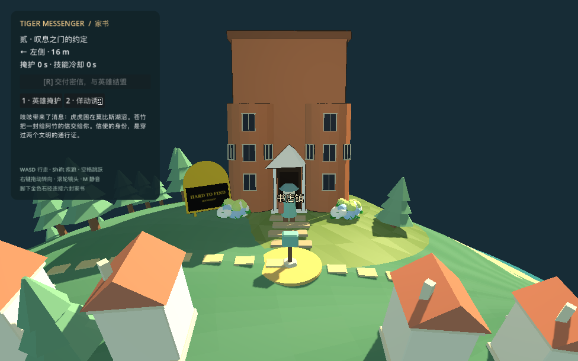

# 书店环境续接 · 2026-09-08

基于已接入的 Blender v3 书店，改善真实环境入口视线，并在 Godot 主场景恢复原建筑墨线。不是新概念图，也不是整世界迁移完成。

## Web 环境

- 新增书店局部建筑/招牌/入口林带避让，实际默认世界过滤 3 棵、保留 38 棵走廊树；手工地图对象不在过滤范围。
- 回归夹具不含轨道排除，所以计数不同：47→45。固定种子保留树的几何哈希、位置、旋转和缩放完全一致，碰撞与树一一对应。过滤发生在原随机消耗之后，避免重排远处林带；被拒绝树只释放独有几何，不释放共享材质。
- 实际完整世界：门前招牌 9 个采样、初始玩家镜头另 9 个采样和入口 3 条射线均无树命中；真实 W 移动、落地和 R 章节 0→1 通过，无页面错误。
- 两段地标陆路五项检查通过，地形未在本批修改。

复查：`rtk proxy node TigerMessenger/tools/test_bookshop_site.mjs`；陆路：`rtk proxy node TigerMessenger/tools/test_landmark_corridors.mjs`。本地预览 `http://127.0.0.1:8767/TigerMessenger/?autostart=1&timeOfDay=0.38`。

结果：`web-site.json`；真实玩家/HUD：`web-gameplay.png`；完整世界单独近景镜头：`web-site-close.png`。两张均已查看，原作飞行器在场且遮挡部分立面，未隐藏世界对象。测试使用 Chrome SwiftShader 软件渲染，不把截图帧率当设备性能结论。

浏览器实查发现已有标签页仍加载旧版 `nature.js`（运行时函数不含过滤调用），普通和忽略缓存刷新均未解决，因此场景入口为该模块增加本次资源版本标识。未清除浏览器地图或剧情存档。

版本标识生效后，用户当前应用内标签页运行时确认 `rejected = 3`；已查看刷新后的真实画面，初始镜头招牌与门前已无此前树冠遮挡。

## Godot 环境

26 个原建筑部件合批恢复暖墨、局部厚度变化与飞白：1 次新增绘制、416 三角形。真实主场景移动/落地/墙体/招牌/R 交信及同镜头开关检查通过。详见 [godot-report.md](godot-report.md)，数据 `godot-integration.json`、`godot-pixels.json`。

原 Blender/GLB、Godot 表面材质和周围场景未改。下一步仍需两阶明暗材质、完整原作书店镇和全场性能工作；不能把局部优化当作全部验收完成。
