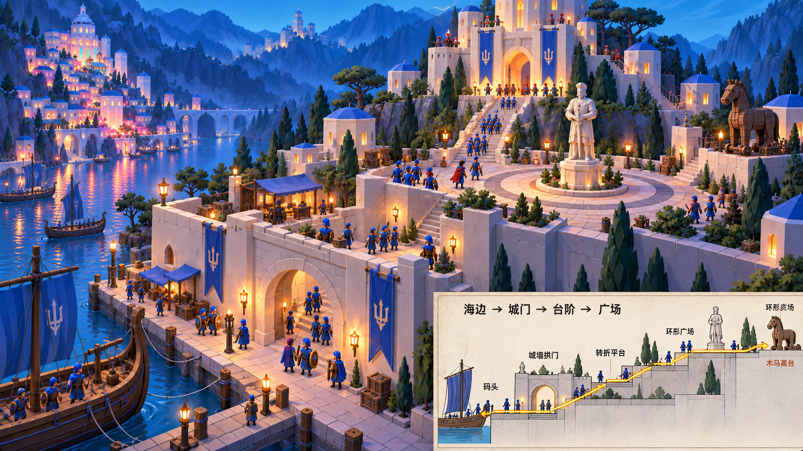

# 圣城：海岸到广场的补充目标

2026-09-12。依据用户截图 `截屏2026-09-12 22.04.44.png`。此文件记录新目标及后续施工验收要求，不代表已经回接游戏。

## 必须保留的构图关系

1. 雕像在环形石砖广场中心，但偏离通向主堡的阶梯轴线；绕行空间连续。
2. 木马位于广场右侧独立高台，以短侧阶连接，平台与雕像所在广场有高差。
3. 临水城墙有供人通过的防御拱门，拱门下为干燥通道，不能把水洞当步行入口。
4. 按用户截图的相机基准，旧城逆时针偏转30度，新城顺时针偏转30度，相互照应。不能直接把屏幕角度当作世界坐标旋转值；施工时固定相机，用两城正面方向对照验收。
5. 码头低、广场高，以分段台阶和转折平台连接；每一段都能实际通行。
6. 广场铺装为环状石砖，绕开雕像后接入上山主阶梯。
7. 按原目标图配置柏树、伞松、灌木和墙边绿植，保持入口、转弯与阶梯净空。

## 连续路径

船舶靠泊 → 低位石码头 → 临水城墙拱门 → 第一段台阶 → 转折平台 → 第二段台阶 → 环形广场 → 偏轴主阶梯 → 主堡城门。

木马高台是广场右侧支路，不承担唯一主通路。货箱与武器存放区避开下船点和拱门。概念图的士兵用于尺寸参照，最终尺寸须由原士兵装备包络、转弯与通行实测确定。

## 实施和验收顺序

- [ ] 新目标图：同一建筑关系的主视图与通路剖面，检查入口、出口、高差是否自洽。
- [ ] 固定目标相机，重定两城朝向与山体承托；同步港口、广场和主堡坐标，保留原角色与剧情引用。
- [ ] Blender迭代码头、墙洞、分段阶梯、木马高台及山岩衔接；WFC建筑模块保留蓝色圆顶和台地层次。
- [ ] 接回8931原游戏，原士兵从靠泊点连续进入广场，再到主堡；不能以瞬移到广场替代上下船。
- [ ] 同步Godot几何、材质、碰撞、通路及灯光；逐段检查头部与装备净空、台阶支撑和转弯。
- [ ] 同相机对照原认可图、补充目标图和两端实际截图，单列差异；铺装与植被在通路通过后补齐。

当前新补图只用于目标设计。既有局部路径测试不代表上述新路线、双城新朝向或整场攻城已经完成。

## 已生成的补图 v1

使用内置生图工具、以用户认可截图为参考生成，未指定或验证底层模型版本。原输出保留于Codex generated_images，项目内保存副本。

视觉复核：低位码头、干燥城墙拱门、上升台阶、偏轴雕像与环形铺装、右侧木马高台及绿植关系已表达。右下剖面是路径示意，末端重复标注环形广场，不能用作精确施工尺寸。两城正负30度的数值不能凭透视图证明，需在场景平面布局中实现并验证。此图不是游戏截图，尚未据此重建或同步两端。
