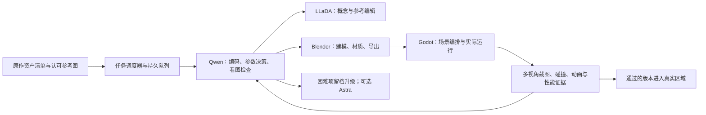

# TigerMessenger 本地资产生产线方案

更新：2026-09-09。目标是用本地 Qwen3.8-27B + LLaDA-Image + Blender + Godot 承担持续生产；Astra 作为可选总监/故障升级通道。保持用户原美术与宏大世界设定，不把批量归档当优化完成。

## 先说明目前交付边界

- 已有 92 个资产/变体登记。它们包含单件、变体和整片场景，不能拿这个分母估计美术完成百分比。
- 之前虎的重复顶点清理没有重塑外观，这是用户看不到改进的重要原因。本轮已有实际新虎、士兵方向修正以及共享边 WFC 城堡输出。
- 城堡候选保留原 town 占用/布局，替换既有城堡中的 12 层 town。它是 Web 工厂完成 WFC 求解后的静态 GLB；尚不是 Godot 原生 Townscaper 交互编辑器，更未完成概念图中的圣城灯光风貌。
- `tools/pipeline/asset_pipeline.py` 已有队列、租约、共享家族互斥、证据哈希和断点恢复。队列自身只记账；新增的本地 runner 执行审查作业、持有 validation 租约，Qwen 桥接可调用它，但尚无真实模型服务和图像生成。
- `tools/pipeline/local/` 已有预检、可恢复 runner、MCP 客户端、Qwen 工具/双图桥接，以及实际通过的五项 Blender/Godot 工程作业。使用见 `LOCAL_PIPELINE_RUNBOOK.md`。Qwen/LLaDA 服务尚未部署，完整美术自主修改仍未实现。

## 生产链与职责



**Qwen 是推理服务，调度器才是工具调用的执行者。** Qwen 返回工具名称和参数；调度器验证任务归属、执行工具，把结果和截图再交给 Qwen。MCP 不会自动让任意模型获得电脑操作能力。

| 组件 | 工作 | 不承担的工作 |
| --- | --- | --- |
| Qwen3.8-27B | 编写/修改 Blender Python、GDScript；读取小范围代码；比较目标图与渲染；提出下一次具体调整 | 不能直接生成可用网格；模型回答“完成”不是验收证据 |
| LLaDA-Image / Turbo | 新概念、指定参考图编辑、材质方向样张 | 不生成 3D 拓扑、碰撞或骨骼；已有用户认可图时直接复用 |
| Blender | 执行几何与材质操作，保留连接点，导出 GLB 和固定镜头图 | 不决定游戏剧情，不直接覆盖原始资产 |
| Godot worker | 资源导入、场景挂载、方向/比例/碰撞/动画验证、截图 | 不依赖人工点击完成每个资产的检查 |
| 调度器 | 队列、资源锁、运行预算、重试、产物缓存、日志、断点恢复 | 不用“文件存在”推断视觉达标 |
| Astra（可选） | 制定代表资产模板、处理失败簇、阶段抽检 | 不逐件搬运文件、反复扫描全库、盯每个导出 |

Qwen 官方模型卡确认其支持图像输入，并可经 vLLM/SGLang 提供兼容 API；看图能力必须在选定量化与推理后端上实测，不能只验证文字接口。[Qwen 模型卡](https://huggingface.co/Qwen/Qwen3.8-27B)

## Qwen 如何连接 Blender

连接分两段：

1. 本地代理调度器 → Qwen 的 `POST /v1/chat/completions`，携带可用工具 schema。
2. 调度器收到 `tool_calls` → MCP Python 客户端 → `uvx blender-mcp==1.9.1`（stdio）→ Blender 插件 `127.0.0.1:9876`。

模型服务可以运行在另一台 GPU 服务器；MCP 客户端与 Blender 保留在制作机。这两台机器通过模型 HTTP 服务连接，不必把 Blender 的执行端口直接暴露到网络。

已有 Blender MCP 可复用。官方项目说明其使用 stdio 客户端和可配置 `BLENDER_HOST/BLENDER_PORT`；但端口可达只代表 socket 接受连接，必须再执行一次只读场景查询和一次临时对象建删，才算端到端通路通过。[Blender MCP 项目](https://github.com/ahujasid/blender-mcp)

交互建模使用前台 MCP，方便人查看。已验证的批处理模板使用独立后台 Blender：每项自己的输入副本、输出目录和日志，最多一个前台写入者。相同士兵家族共用头盔/裙甲模板，红蓝仅改参数。

### 用户指定的 Apple Silicon 部署

目标机器已明确：**Mac Studio M5 Max，64GB 统一内存**。按 MLX 4 位 Qwen + 支持视觉和工具调用的 oMLX 候选服务部署，具体步骤与资源调度见 [Mac 部署档案](LOCAL_ASSET_FACTORY_MAC.md)。此前 vLLM/CUDA 示例不适用于本次 Mac 主方案。

当前连接的是 M2、16 GiB；尚未取得目标 Studio 的连接入口，不在当前机器自动下载大模型。初次接线测试依次验证：`/models` → 简单回答 → 真实 `tool_calls` → 工具返回结果后的续答 → 参考图输入。不要跳过后两项就开始批量建模。

## LLaDA-Image 如何接入

官方 CUDA 环境可使用独立 Python 3.11 环境。用户的 Mac 需先走兼容性验证，不能原样安装其 CUDA/flash-attn 依赖；详细门槛见 Mac 部署档案。模型发布包含 Base 和 Turbo，官方推荐分别使用 50 与 4 次采样；都支持文本生图和参考图编辑。[LLaDA-Image 官方说明](https://github.com/inclusionAI/LLaDA-Image)

调度器调用我们封装的图像 worker，worker 调用官方 `LLaDAImagePipeline`。不要把它假装成已经存在的 OpenAI Images API。

拟定接口：

- `POST /jobs`：提交 `asset_id / prompt / reference_artifact / mode / seed / size / model_revision`，立即返回 job ID。
- `GET /jobs/{id}`：读取状态、失败原因、输出路径和 SHA256。
- `GET /health`：区分进程存活、模型已加载、GPU可用三种状态。

先用 Turbo 做小图探索；确有必要时用 Base 产出定稿参考。用户认可的虎图、士兵图和圣城图直接锁定，不每批重画。提示词、种子、参考图哈希与模型版本必须入档。

官方实现依赖 CUDA/PyTorch，并含固定视觉语言模块；“6B”不能直接当成整套服务的显存需求。目标 M5 Max 64GB 可承担制作与调度规划，但 LLaDA 的 MPS 注意力、复数 RoPE 和完整推理仍需验证；详见 Mac 部署档案，不承诺原样运行官方 CUDA 路径。[模型结构说明](https://arxiv.org/abs/2609.03796)

## Godot 如何连接

第一版使用官方命令行 + 项目内 GDScript worker，比依赖另一个未经核对的 Godot MCP 更容易复现。需要时，再把这些稳定命令包装成我们自己的 MCP 工具；Qwen 只看到少数任务级工具。

```text
inspect_asset(asset_id)
edit_blender_candidate(asset_id, revision, operations)
render_candidate(asset_id, cameras)
import_godot_candidate(asset_id, revision)
validate_asset(asset_id, checks)
deploy_to_region(asset_id, placement_id)
read_job_result(job_id)
```

Godot 官方支持 `--headless --import`、`--check-only --script` 和 `SceneTree` 批处理脚本。后台导入在隔离项目或无编辑器竞争的工作副本执行；不要同时让多个进程改同一 `.godot` 导入缓存。图像验收必须另跑有实际渲染后端的 worker，纯 `--headless` 解析不能证明画面正确。[Godot 命令行文档](https://docs.godotengine.org/en/stable/tutorials/editor/command_line_tutorial.html)

交付进入真实世界前检查：稳定资产 ID、原 parent/挂点、前向/上向、缩放、材质、动画状态、地面/碰撞、包围盒和原位切换。士兵头盔的 +X/+Z 错误就是必须固化到模板验收的例子。

## 批次、并发和断点

按资产家族建立模板：

1. 建筑：书店、古堡模块、城墙、桥、门、传统城镇材料。
2. 人形：罗马兵、重甲兵、英雄；颜色和装备是变体参数。
3. 载具：泡舱、侦察机、运输艇；驾驶舱/灯/门为连接点。
4. 生物：湖沼之虎、红狐、鲲；每个英雄生物需要专门造型和动作验收，不能批处理清理后就算完成。
5. 环境：岩石、植物、地台等可重复应用的几何/材质规则。

同一家族先把一个代表件做对，再推广参数；一个完整 town 不与一个杯子按同样成本计数。

起始并发是资源约束，而不是开十个聊天：

- 一个前台 Blender MCP 写入者。
- 一至两个后台 Blender 作业，先测内存/渲染开销。
- 一个 Godot 集成提交者，各作业先在隔离目录验证。
- Qwen 与 LLaDA 若争用同一块 GPU，按阶段交替；显存没有验证前不同时满载。
- 同资产/同家族有租约锁；不同区域的独立任务可并发准备。

任务状态：`待处理 → 参考锁定 → 候选生成 → 几何验证 → 引擎验证 → 视觉复查 → 区域可玩验收`。失败记录错误签名和最后产物；相同错误最多自动修复两轮，然后进入待审队列并继续其他资产，不无限循环烧算力。

恢复时读取队列中的 hash 和租约，不重新通读整个工程。上游图或模型变更，只作废其下游证据；原文件和已通过版本保留。长任务每阶段保存 .blend、脚本、日志、截图和运行预算。

## 视觉和工程验收

参考图与 3D 的相机、投影和光照不同，不能把两者直接作逐像素差值并要求趋零。采用多视角轮廓、关键部位比例、朝向、色块和材质的明确检查；同镜头的新旧引擎截图才适合做像素回归。Qwen 看图结论需要图像文件与几何检查共同支持。

每项至少保留：参考图、修改脚本、源/候选 .blend、GLB、前/侧/背视图、实际区域截图、动画接触检查、面数/绘制/材质统计、可回退版本。验收报告由测试脚本生成；模型不能自己把失败改成通过。

## 建设顺序与交付门槛

| 阶段 | 做什么 | 通过条件 |
| --- | --- | --- |
| A：样板收口 | 城堡原位对接；士兵方向；虎的实际模型更新 | 能在 Godot 按原位切换对照，明确剩余玩法缺口 |
| B：环境接线 | 核实机器，部署 Qwen，接 MCP，独立部署 LLaDA | 文本/工具/看图测试，Blender临时作业，LLaDA一次编辑，Godot一次场景测试都成功 |
| C：本地闭环 | 在旧队列上增加常驻runner、MCP client和image worker | 不依赖 Astra 的单资产从领取到截图完成；人为中断后从阶段恢复 |
| D：小批标定 | 选士兵变体、载具小件、城堡模块各一例，再做5–10项 | 记录每项GPU时间、重试数、通过率和美术问题；据此设实际产能 |
| E：扩展到区域 | 按主线区域成批接入，最后改地形 | 在真实区域中游玩和验收，而不仅是导出数量上升 |

不承诺 Qwen27B/LLaDA6B 与 Astra/gpt-image-2 等质，也不从这次账号额度百分比反推每件资产成本。以样板的首次通过率和每个合格资产总用时决定哪些步骤完全本地化；复杂英雄生物保留阶段抽检。

## 已建立的配置入口与待完成项

- 配置与检查：`tools/pipeline/local/README.md`、Mac 配置、`doctor.py`、`qwen_probe.py`；实际作业与恢复见 `LOCAL_PIPELINE_RUNBOOK.md`。
- 已有生产记账：`tools/pipeline/asset_pipeline.py`、`assets/pipeline/queue.json`。
- 已实现：单轮持久执行器、MCP 客户端、受限 Qwen 工具循环与双图输入、静态状态页。尚待实现：真实服务部署、LLaDA HTTP worker、建模修改模板、常驻生产调度与模型内存卸载策略。
- 目标硬件已明确为用户的 M5 Max 64GB；尚缺这台机器的连接入口/模型服务地址，目标 macOS 版本待连接核验。无需重新询问硬件或项目授权，取得入口后按 Mac 档案执行阶段 B。

其他模型接手时先读本文件和 `PROJECT_HANDOFF.md`，运行连接预检和队列状态；不得把“预检工具已写”报告成“模型服务已上线”。
