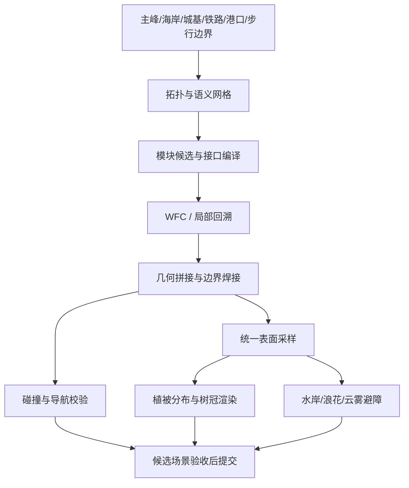

> 2026-10-04 更新：当前覆盖及纠错以 [深入研究总报告](OSKAR_DEEP_RESEARCH_STATUS.md) 为准。下文保留历史记录，不代表最新覆盖或当前实现。

# Oskar 开发演示研究与山海生成引擎草案

日期：2026-09-28。状态：**公开材料初步研究，X 登录媒体页尚未遍历，不能称全部 vlog 已看完。引擎是项目设计草案，不是 Oskar 原引擎源码，也不是已接入的新引擎。**

## 证据范围

用户已开启 Chrome 脚本权限并登录 Codex 内置浏览器。已发现内置浏览器 X 媒体标签；本轮 DOM 与 evaluate 读取均超时。不能再归因为用户未登录或未开放权限。登录媒体页尚未完成遍历；公开材料研究继续。

已阅读作者技术帖的公开镜像，使用浏览器播放可访问的嵌入视频，按约 5%、28%、51%、74% 时刻取样检查。抽样帧不等于完整观看全部时长。逐视频加载结果和时间点在 `artifacts/research/oskar-engine/public-media.json`；失败项保持失败，不计入已看。演讲目前仅定位链接，未完整观看。公开镜像是部分存档，不代表作者完整时间线。

## 研究索引

| 编号 | 作者材料 / 原帖 | 可读取证据 | 对引擎的意义 |
|---|---|---|---|
| S01 | [双网格，2021-10-13](https://x.com/OskSta/status/1448248658865049605) / [作者帖镜像](https://threadreaderapp.com/scrolly/1448248658865049605) | 作者文字已读 | 游戏逻辑网格与表现网格分开；地形过渡在 dual grid 处理 |
| S02 | [草丛 billboard，2022-11-10](https://x.com/OskSta/status/1590669875869286400) / [作者帖镜像](https://threadreaderapp.com/thread/1590669875869286400.html) | 作者文字、部分动态画面取样 | 背景对比影响轮廓，深度处理改善草片穿插；不是 WFC 直接生成草的渲染效果 |
| S03 | [混合网格与特殊岩形，2023-06-19](https://x.com/OskSta/status/1670790425232175108) / [作者帖镜像](https://threadreaderapp.com/thread/1670790425232175108.html) | 作者文字、动态画面取样 | 作者比较规则方格与三角/混合方案；稀有模块受上下文约束 |
| S04 | [作者公开串文目录](https://threadreaderapp.com/user/OskSta)中 2021-10-11/12 岛屿生成及 11-11 拓扑实验 | 作者文字、相关视频取样 | 缓坡和硬崖并存；有向河流使求解更难；生成过程可视化有调试价值 |
| S05 | [WFC 原作者仓库](https://github.com/mxgmn/WaveFunctionCollapse) | 文本与算法说明已读 | 邻接传播、熵、矛盾处理；Bad North 的通行启发式；Townscaper 的组合技术 |
| S06 | [Oskar 官方作品站](https://oskarstalberg.com/) / [作者作品档案](https://oskarstalberg.tumblr.com/) | 页面文字已读 | Brick Block、Polygonal Planet 等作品沿革；未把旧作品等同后期岛屿系统 |
| S07 | [树木实验候选原帖](https://x.com/OskSta/status/1849427564034498642) | 历史为仅定位；2026-10-04已读作者镜像并检查10.02秒动图时间序列 | 作者称octagonal impostors，完整shader仍未知 |
| S08 | [已纠正云原帖](https://x.com/OskSta/status/1852334860137849222) | 2026-10-04确认旧1852421920219635966只是GifCam回复；已读真正云帖镜像并检查7.08秒动图时间序列 | 可确认与树共用impostor，完整shader/云运动仍未知 |
| S09 | [Beyond Townscapers 演讲](https://www.youtube.com/watch?v=Uxeo9c-PX-w) | 链接已定位，未完整观看 | 待与帖子年代逐项对照 |
| S10 | [Wave Function Collapse in Bad North](https://www.youtube.com/watch?v=0bcZb-SsnrA) | 链接已定位，未完整观看 | 待补导航与求解过程证据 |

作者镜像的转载文字按作者本人陈述引用。其他作者的复刻项目只可作实现参考，不能证明 Oskar 的私有实现。尚未确认 MCF 是这些作品的核心；Marching Cubes、WFC、网格松弛是不同职责。

## 已看到的视觉差异

S03 的几个转动角度能看见：低海岸台面、独立高崖、沿山肩升起的连接面、开口/洞穴，以及与地形相接的建筑。S02 的调试画面显示：草沿坡肩形成细碎轮廓，背景不同处线条强弱不同。仅凭这些画面不能反推出唯一的求解器、噪声函数或 shader 代码。

当前十二门徒初版只在单根岩柱的纵向半径接口上运行 WFC。它缺少横向台地连接、可用台面、崖边语义，以及与植被/水面一致的表面数据。因此“有 WFC”与“出现目标中的多级山势”不是同一件事。

## 提议：项目内的山海生成引擎

以下为我们的工程设计，不是对 Oskar 未公开代码的断言。保留 Three.js 和现有游戏系统，在其上统一生成数据、几何和表现。

### 1. 先统一空间和保护边界

主数据明确 planet frame、局部地形 chart、海面曲率与高度单位。每个点的 up 来自统一 surface sampler；不能让石头用一张球面、海水画另一张曲面、树根再用父对象 Y。铁路用车辆扫掠体和缓冲区表示；城基和港口通路固定，禁止在全局平滑中被搬动。

接口建议：`sampleSurface(worldPoint, kind)` 返回 position、normal、surfaceId、height、wetness、walkable、geometryRevision。水面、岩脚和植被共享版本；没有承托面就拒绝实例，而不是悬空放置。

### 2. 从环形剖面升级为面状模块

第一批建立基座、海蚀凹槽、宽岩台、内/外崖角、缓坡、山肩、鞍部、断裂峰顶和坡脚模块。每块同时有美术几何与语义：边界曲线、端点高程、坡向、地层、承托、可行走/可种植区域。接口要验证几何曲线，而非只比较字符串或单个半径。

先用少量模块做“低基座 → 宽台面 → 陡崖 → 上台面 → 非对称峰顶”的人工拼装样例，确认四面轮廓。样例不好看就继续改模块，不让求解器掩盖模块质量问题。

### 3. WFC 负责局部兼容，整体山势单独约束

复用现有带上限回溯的通用求解器。输入是预定峰脊/台地掩码与固定通道，再对邻接图求解模块、转向和变体。硬约束包括边界位置、轨道净空、上下承托与接口匹配；软权重控制峰高、宽台面占比、连续崖壁长度和重复率。

单靠邻接规则不能保证全局步行连通或河流出海。必须额外检查路径连通和流向图；失败时定位小区域回退，保留锁定点，不无限重抽整城。作者提到“无局部低点”的地形目标，不等于已经证实使用物理水力侵蚀。

### 4. 几何编译与网格选择

第一阶段采用便于现有场景接入的局部网格；不为了追求“混合”立刻替换全世界。三角/四边形混合、dual grid 与表面拓扑是可升级的图适配器。保留硬崖折线，仅对明确软坡区域做受限松弛。MC 可用于选定的体积表面提取，不能把所有模块重新平滑成圆柱。

### 5. 植被分布与植被画法分开

分布读取真实台面、坡度、湿度、盐雾带、土层和禁入区。先聚落式种植，再做间距约束；宽台地可长树、窄肩长灌木、迎浪岩脚保留裸岩。根部复投影到最终网格，近景碰撞采用真实承托面。

表现复用现有植被编译与实例系统；近景树干/枝叶几何，中远景树冠 impostor。草的背景对比描边可作独立实验，不能用统一黑边覆盖全部草片。作者的草渲染实验是确定线索；具体 atlas 编码和采样细节还需核对。

### 6. 云、蒸汽和水

树冠与云可共享部分 impostor 数据/实例绘制框架，材质、光照和深度策略分开。云需要风向、寿命、密度、高度带和遮挡；蒸汽另有发射源与浮升。WFC 最多为云雾提供分布语义，不模拟云的运动。沿用项目已存在的云系统，先验证完整多视角体积感，再考虑统一。

水面与岸线应使用同一曲面定义。泡沫由岸距/交界产生，岩脚真正入水；漂浮浪花不能遮掩错误基座。铁路高度相对该水面验证，不另维护一套近似高度。

### 7. 工具与可观察性

提供“语义层 / 候选域 / 接口 / 冲突 / 台面 / 禁入区 / 植被根点 / 实际渲染”切换。记录 seed、模块版本、锁定约束、输入与输出 hash。生成在候选场景中完成，经校验后整体替换；保留旧版和一键回退。

## 当前代码如何复用

以下是本次读过的入口，不表示整条链已通过审计：

| 现有入口 | 已确认的职责 | 本次结论 |
|---|---|---|
| `src/procgen/wfc/solver.js` | 熵选择、传播、限界回溯、pins/bans | 作为通用求解基础；避免再写孤立求解器 |
| `src/procgen/wfc/moduleSchema.js` | 六方向接口、承托/净空等数据 | 需扩充岩台几何边界和台面描述 |
| `src/procgen/planet/terrainTiles.js` | 地形语义目录 | 语义名字不等于实际美术模块；需与编译几何一一对应 |
| `src/world/seaStackWfc.js` | 单柱纵向剖面 WFC | 仅可保留为旧版对照，不能充当完整台地系统 |
| `src/procgen/planet/vegetationCompilerV9.js` | 生态采样、三角面放置、禁入与 LOD | 接入统一表面版本并核对岩台支持 |
| `src/render/clouds/impostorAtlasBuilder.js` | 云与共享 atlas 构建入口 | 现有框架可评估复用，不能仅因命名相似就称还原 Oskar |
| `src/render/clouds/cloudImpostorMaterial.js` | 云材质、视图采样与运动输入 | 下一阶段做多机位、深度和日夜验证 |

## 实施顺序与验收

1. 先补全 X 媒体证据目录：逐帖永久链接、日期、主题、媒体数、观看区间、明确说明/视觉观察/推论。滚动到底或出现访问限制都记录停止原因；未知总量不写“100%”。
2. 用实际岩群附近的一块试验区制作宽台地样例，保护轨道；近景/飞艇/铁路三个视角验收轮廓、岩脚入水和阶层高差。
3. 接通通用 WFC 与真实模块库，加入跨台地接口和路径校验；至少多种 seed 检查裂缝、穿轨、断路和求解失败。
4. 真实岩台上的植被；然后是共享树冠/云渲染实验。云开启与关闭都检查山势，避免用雾遮挡造型错误。
5. 固定镜头性能基线、draw calls、P95 帧时和内存对照后再扩大到圣城。硬检查通过与美术验收分开记录。

第一阶段完成标准是“一个可重复、可回退、可看出宽台地层次的场景样块”，不是“文件里出现 WFC/MC/Impostor 几个名称”。

## 2026-09-29 Conference follow-up
See artifacts/research/oskar-engine/conference-study.md and conference-coverage.json. Four primary talk identities verified; Beyond mirror transcript 00:00-51:03 read without audiovisual validation. Browser seek attempts yielded no decoded frames; no complete talk was watched. Skill references/conferences.md now routes to this evidence and separates later experimental topology from 2018 Bad North. User subsequently authorized continued sea-stack implementation based on available coastal evidence; research gaps remain explicit.
